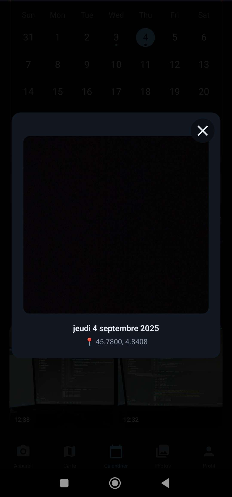
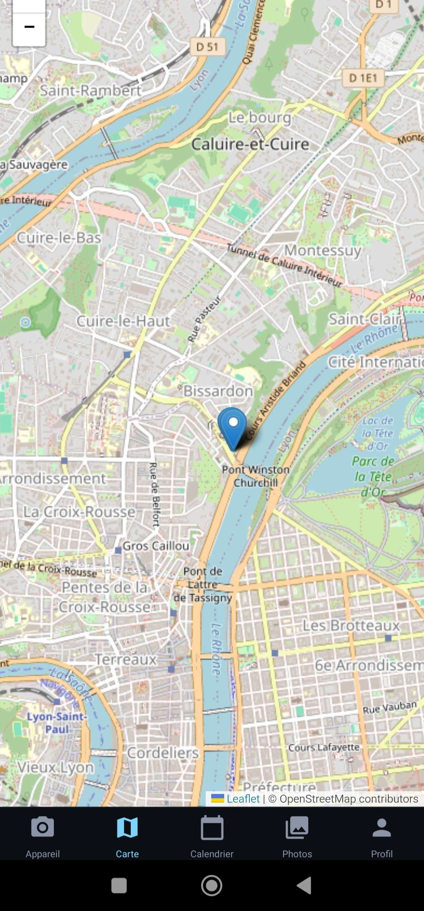
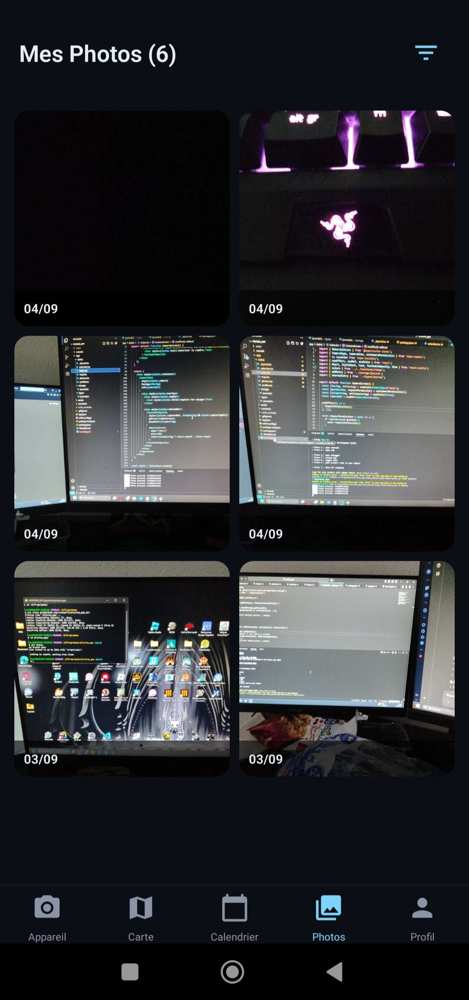
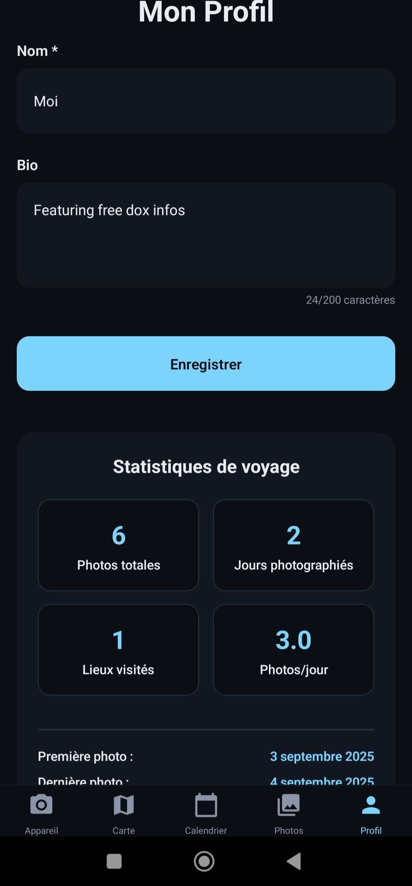
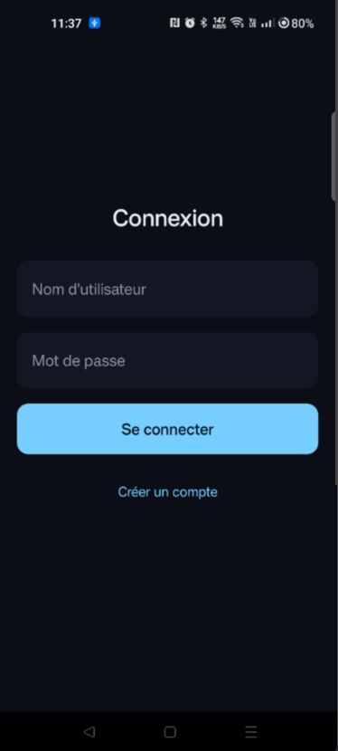

# Travel Journal App

Une application mobile de journal de voyage développée avec React Native et Expo Router, permettant de prendre des photos de voyage avec géolocalisation et de les retrouver sur une carte interactive.

## Fonctionnalités

- **Capture photo** : Prendre des photos directement depuis l'application
- **Géolocalisation** : Enregistrement automatique de la position GPS
- **Calendrier interactif** : Visualisation vos photos par date
- **Carte interactive** : Exploration des voyages sur une carte avec Leaflet
- **Galerie** : Une liste de toutes les photos prises
- **Profil** : Statistiques personnalisées
- **Login** : Fonctions d'authentification et d'enregistrement des utilisateurs


## Technologies Utilisées

- **React Native** avec Expo
- **Expo Router** pour la navigation
- **Expo Camera** pour la capture photo
- **Expo Location** pour la géolocalisation
- **AsyncStorage** pour le stockage local
- **React Native Calendars** pour l'affichage calendrier
- **React Native WebView** avec Leaflet pour la cartographie
- **TypeScript** pour un code type-safe

## Installation et Lancement

### Prérequis
- Node.js (v16 ou supérieur)
- Expo installé globalement
- Un appareil mobile avec l'app Expo Go SDK 51, ou un émulateur Android/iOS (iOS jamais testé, Android recommandé)

### Installation

1. **Cloner le projet**
   ```bash
   git clone git@github.com:Linnaelle/piscine_app.git
   cd piscine_app
   ```

2. **Installer les dépendances**
   ```bash
   npm install
   ```

3. **Lancer l'application**
   ```bash
   npx expo start
   ```


### Permissions Requises

L'application demande automatiquement les permissions suivantes :
- **Caméra** : Pour prendre des photos
- **Localisation** : Pour enregistrer les coordonnées GPS

## Architecture du Projet

### Structure des Dossiers

```
piscine_app/
├── android/                    # Le build de l'application sur android, nécessaire pour faire fonctionner la carte
├── app/                        # Pages de l'application (Expo Router)
│   ├── (tabs)
│   ├──   ├── _layout.tsx       # Configuration des onglets
│   ├──   ├── calendar.tsx      # Écran Calendrier
│   ├──   ├── camera.tsx        # Écran Appareil Photo
│   ├──   ├── map.tsx           # Écran Carte
│   ├──   ├── photos.tsx        # Écran Galerie
│   ├──   └── profile.tsx       # Écran Profil
│   ├── _layout.tsx             # Configuration des onglets
│   └── index.tsx               # Écran Login
├── constants/
│   └── theme.ts                # Thème et couleurs
├── storage/
│   ├── journal.ts              # Gestion du stockage local
│   ├── user.ts                 # Gestion des utilisateurs
│   └── auth.ts                 # Gestion de l'authentification
├── types/
│   ├── user.ts                 # Modèles utilisateurs
│   └── journal.ts              # Modèles de donnée
└── screenshots/                # Captures d'écran
```

### Modèles de Données

#### JournalEntry
```typescript
type JournalEntry = {
  id: string;           // Identifiant unique
  uri: string;          // Chemin vers l'image
  latitude: number;     // Coordonnée GPS latitude
  longitude: number;    // Coordonnée GPS longitude
  timestamp: number;    // Timestamp de création
  dateKey: string;      // Clé de date (YYYY-MM-DD)
};
```

#### UserEntry
```typescript
type UserEntry = {
  id: string;           // Identifiant unique
  username: string;     // Nom d'utilisateur
};
```

### Vues et Écrans

#### 1. CameraScreen (`app/(tabs)/camera.tsx`)
- **Fonctionnalité** : Capture de photos avec géolocalisation
- **Composants clés** : `CameraView`, `TouchableOpacity`
- **Permissions** : Caméra et Localisation
- **Storage** : Sauvegarde automatique via `addEntry()`


#### 2. CalendarScreen (`app/(tabs)/calendar.tsx`)
- **Fonctionnalité** : Navigation par dates avec aperçu photos
- **Composants clés** : `Calendar`, `FlatList`, `Modal`
- **Data** : `getMarkedDates()`, `getEntriesByDate()`
- **UI** : Grille 2 colonnes, modal photo plein écran


#### 3. MapScreen (`app/(tabs)/map.tsx`)
- **Fonctionnalité** : Carte interactive avec markers
- **Composants clés** : `WebView` avec Leaflet
- **Data** : Toutes les entrées avec coordonnées GPS
- **Interaction** : Clic sur marker → modal photo



#### 4. PhotosScreen (`app/(tabs)/photos.tsx`)
- **Fonctionnalité** : Galerie avec filtres
- **Composants clés** : `FlatList`, `Picker`, `Modal`
- **Features** : Filtre par date, compteur photos
- **UI** : Grille responsive, overlay dates


#### 5. ProfileScreen (`app/(tabs)/profile.tsx`)
- **Fonctionnalité** : Profil utilisateur et statistiques
- **Storage** : `AsyncStorage` pour données utilisateur
- **Statistiques** : Total photos, jours, lieux, moyennes
- **UI** : Formulaire + cards statistiques


#### 6. LoginScreen (`app/index.tsx`)
- **Fonctionnalité** : Création de compte, connexion et aperçu des utilisateurs
- **UI** : Formulaire + cards utilisateurs


### Gestion du Stockage

#### AsyncStorage Keys
- `TRAVEL_JOURNAL_ENTRIES_V1` : Toutes les entrées journal
- `TRAVEL_JOURNAL_USER_V1` : Données utilisateur

#### Fonctions Storage (`storage/journal.ts`)
- `getEntries()` : Récupère toutes les entrées
- `addEntry(entry)` : Ajoute une nouvelle entrée
- `getEntriesByDate(dateKey)` : Filtre par date
- `getMarkedDates()` : Dates avec photos pour calendrier

#### Fonctions Authentification (`storage/auth.ts`)
- `isAuthenticated()` : Vérifie si un utilisateur est authentifié
- `setAuthenticatedUser()` : Définie un utilisateur comme connecté
- `getAuthenticatedUser()` : Récupère l'utilisateur authentifié

#### Fonctions Utilisateur (`storage/user.ts`)
- `createUser()` : Crée un utilisateur
- `getAllUsers()` : Récupère la liste des utilisateurs
- `getUser()` : Récupère les informations d'un utilisateur
- `loginUser()` : Connecte un utilisateur à l'application

### Thème et Design
Le design utilise un thème sombre moderne défini dans `constants/theme.ts` :

```typescript
export const colors = {
  bg: '#0B0F14',        // Arrière-plan principal
  card: '#121821',      // Cartes et modales
  text: '#E6EDF3',      // Texte principal
  primary: '#7CD4FD',   // Couleur d'accent
  muted: '#8A94A6',     // Texte secondaire
};
```

## 🔧 Développement

### Scripts Utiles
```bash
# Build pour activer la carte
npx expo prebuild
eas build --platform android

# Si eas est bloqué par l'Execution Policy
Set-ExecutionPolicy -ExecutionPolicy RemoteSigned -Scope Process
eas build --platform android

# Lancer en mode développement
npx expo start
```

## Améliorations Futures

- [ ] Synchronisation cloud (Firebase/Supabase)
- [ ] Export des données (JSON/CSV)
- [ ] Partage de photos
- [ ] Reconnaissance de lieux (reverse geocoding)
- [ ] Tags et catégories
- [ ] Recherche textuelle
- [ ] Mode sombre/clair
- [ ] Statistiques avancées avec graphiques
- [ ] Système de social (ami, likes, etc..)
- [ ] Stockage cloud des utilisateurs plutôt que local
- [ ] Aspect jeux vidéo (récompenses, points, etc)